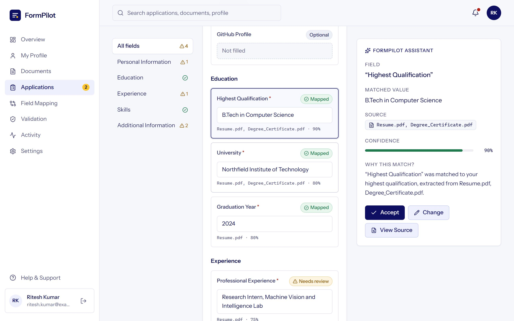
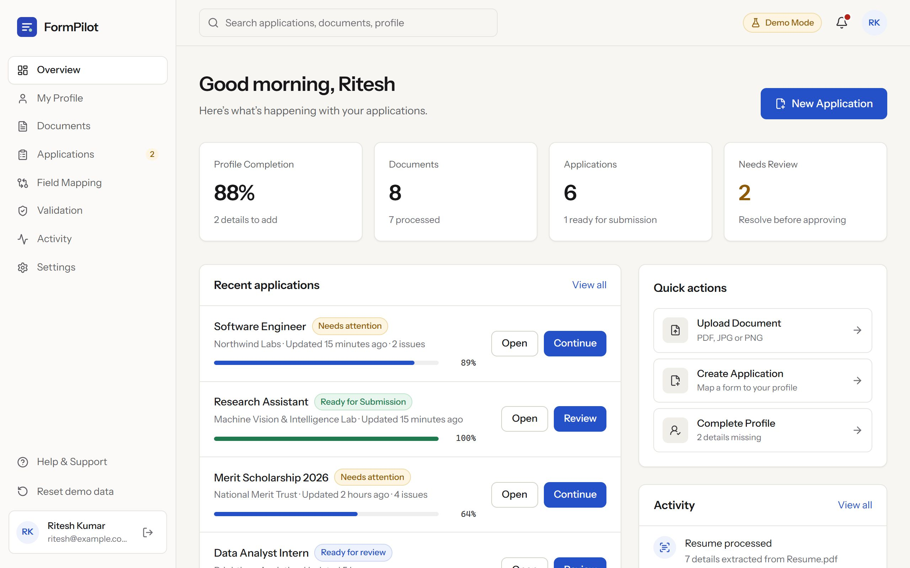
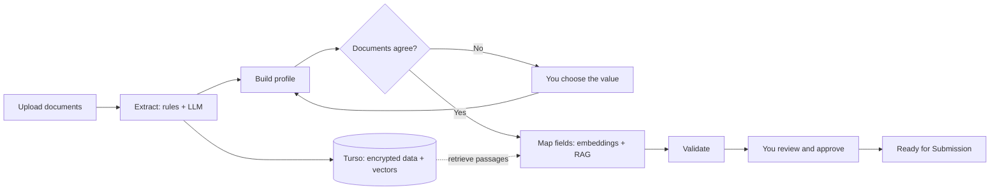

<div align="center">


# FormPilot

**Your reusable application profile. Build once. Verify once. Reuse everywhere.**

Instead of typing the same information into every website, you create your verified profile once in FormPilot. When you meet another application, FormPilot understands the form, finds the right information, fills what it can, flags what it can't, and lets you review everything before you submit.


</div>

<br />



<p align="center"><sub>The application workspace: every form field with its status, and the assistant showing the source document, confidence and reasoning for the selected answer.</sub></p>

---

## Contents

- [The problem](#the-problem)
- [What FormPilot does](#what-formpilot-does)
- [Screenshots](#screenshots)
- [How it works](#how-it-works)
- [Tech stack](#tech-stack)
- [Getting started](#getting-started)
- [Configuration](#configuration)
- [App pages](#app-pages)
- [API reference](#api-reference)
- [Project structure](#project-structure)
- [Testing](#testing)
- [Security](#security)
- [Deployment](#deployment)
- [Roadmap](#roadmap)
- [Contact](#contact)
- [License](#license)

## The problem

Students, job seekers and professionals type the same facts into portal after portal: name, date of birth, degree, institution, experience, skills. Every form words its questions differently ("Name of applicant", "Full legal name", "Candidate name"), so copy and paste never quite works, and a single mistyped date can put an application at risk. The information already exists in the documents people have. It just isn't reusable.

## What FormPilot does

| | |
| --- | --- |
| **Master Profile** | Personal and contact details, education, work experience, skills, projects, achievements, certifications, professional links and addresses. Every value shows its source documents, verification status (confirmed by you, found in several documents, or read with high confidence), last-updated date and confidence. |
| **Application Vault** | Master Profile, documents, saved applications, application templates and common answers in one place. |
| **Use FormPilot anywhere** | A Chrome/Edge extension (Manifest V3) that fills forms on **any** website from your profile, with no site-specific code: it detects the fields, FormPilot works out what each one means, you review the matches with their confidence, then click Autofill. Handles dropdowns and radio buttons, date formats, uploads from your vault, forms that load later and multi-step forms. Never submits. The in-app CareerHub demo runs the same code. See [`extension/README.md`](extension/README.md). |
| **Smart Answers** | Suggested answers to open questions ("Why do you want to join us?") drafted from your profile, documents and saved answers, with the sources shown. Always a suggestion: Use, Edit or Regenerate. |
| **Templates** | Save a completed application as a template. When a similar form appears, FormPilot offers to reuse its answers; reused values are marked for review. |
| **Document extraction** | Reads PDFs (and scanned images when OCR is enabled). Pattern rules and an LLM on Groq extract name, contact details, date of birth, degree, institution, graduation year, experience, skills and profile links, each with a confidence score. Every LLM value must appear in the document or it is discarded. |
| **Reusable profile** | Merges details from all your documents into one profile. Every value lists the documents it came from. |
| **Conflict detection** | When two documents disagree (for example, two different dates of birth), FormPilot shows both values with their sources and asks you to choose. Your choice is saved and applied everywhere. |
| **Semantic field mapping (RAG)** | Matches form labels to your details by wording and by meaning (local embeddings), retrieves the most relevant passages from your documents from Turso's vector search, and lets the LLM choose each answer. Answers must trace back to your profile or a passage. |
| **Validation** | Before approval, every application is checked for conflicts, missing required fields and low-confidence matches, each with a one-click fix. |
| **Human approval** | You review every answer and approve explicitly. FormPilot never submits anything; approval marks an application *Ready for Submission*. |
| **Workflow engine** | Every document and form runs through recorded steps (read, extract, validate, index; retrieve, classify, generate, validate), visible in the app and the API. |
| **Integrations** | Signed webhooks for document and application events, and an autofill API that returns approved answers as label/value pairs. |

## Screenshots

| Dashboard | Application workspace |
| --- | --- |
|  |  |

Real captures of the app with sample documents. Mobile versions are in [`frontend/public/screens/`](frontend/public/screens/).

## How it works



1. **Upload.** PDF, JPG or PNG up to 10 MB. The file type is checked from its bytes, and the file is encrypted before it is written to disk.
2. **Extract.** The PDF text layer (or OCR text) is parsed by pattern rules and, when `GROQ_API_KEY` is set, by an LLM with a strict JSON schema. Results are merged field by field: agreement raises confidence, disagreement lowers it so you check, and any LLM value that can't be found in the document is dropped. Ambiguous values, such as `12/05/2003`, are flagged for review.
3. **Index.** The text is split into passages, embedded locally with `BAAI/bge-small-en-v1.5` (fastembed), and stored in Turso as `F32_BLOB` vectors.
4. **Build the profile.** Values from all documents are merged. Identical values list every source; different values become a conflict.
5. **Map (RAG).** Each form label is classified by wording (token and trigram overlap), then by meaning (embedding similarity) if wording fails. The label is embedded and the closest passages are retrieved with `vector_distance_cos`. The LLM sees the profile plus those passages and picks each answer; FormPilot accepts an answer only if it equals a profile value or appears in a retrieved passage. Conflicted fields are never filled.
6. **Validate and approve.** Conflicts and missing required fields block approval until resolved. Optional fields (such as GitHub) never block.

Without a Groq key, steps 2 and 5 run without the LLM: rules, embeddings and retrieval still work.

## Tech stack

| Layer | Technology |
| --- | --- |
| Frontend | React 19, TypeScript, Vite, Tailwind CSS 4, React Router 7, Framer Motion, Lucide icons |
| Backend | Python 3.10+, FastAPI, SQLAlchemy 2, Pydantic 2 |
| AI / ML | LLM on Groq (`openai/gpt-oss-120b`, strict JSON schema), local embeddings (fastembed, `bge-small-en-v1.5`), semantic search and RAG |
| Database | Turso (libSQL) with native vector search; a local libSQL file in development |
| Documents | pypdf for text extraction, optional Tesseract OCR |
| Automation | Workflow engine with recorded steps, signed webhooks, autofill API |
| Auth & security | scrypt passwords, JWT session in an httpOnly cookie, Sign in with Google (OAuth 2.0 + PKCE), Fernet encryption of files and personal data |
| Testing | pytest with the FastAPI TestClient, plus an accuracy eval (`backend/eval/`) |

## Getting started

### Prerequisites

- Python 3.10 or later
- Node.js 20 or later

### 1. Clone

```bash
git clone https://github.com/RiteshKumar2e/Formpilot.git
cd Formpilot
```

### 2. Backend (port 8000)

```bash
cd backend
pip install -r requirements.txt
cp .env.example .env                 # then add your Turso and Groq keys (both optional locally)
uvicorn app.main:app --reload --port 8000
```

The first start downloads the embedding model (about 70 MB) once. Interactive API docs: http://localhost:8000/api/docs (disabled in production).

### 3. Frontend (port 5173)

```bash
cd frontend
npm install
npm run dev
```

Open http://localhost:5173, create an account, and upload a resume or certificate. The Vite dev server proxies `/api` to the backend, so no extra configuration is needed locally.

### 4. Browser extension (optional)

```bash
cd frontend
npm run build:extension             # builds extension/dist
```

Load `extension/dist` in `chrome://extensions` or `edge://extensions` (Developer mode → Load unpacked), then open **Browser Extension** in the app and click **Connect this browser**. Details: [`extension/README.md`](extension/README.md).

> **Windows tip:** `WinError 10013` when starting uvicorn means port 8000 is already in use. Stop the other process, or use `--port 8001` and update the proxy target in `frontend/vite.config.ts`.

### Optional: OCR for scanned documents

```bash
pip install -r requirements-ocr.txt
```

Also install the [Tesseract](https://github.com/tesseract-ocr/tesseract) binary. Without it, images upload successfully but are marked *needs review* with no details extracted.

### Turso database

```bash
turso db create formpilot
turso db show formpilot --url          # -> TURSO_DATABASE_URL
turso db tokens create formpilot       # -> TURSO_AUTH_TOKEN
```

Put both in `backend/.env`. Tables are created on first start. Without them, the backend uses a local libSQL file (`formpilot.db`) with the same engine and vector search.

### Groq LLM

Create a key at [console.groq.com/keys](https://console.groq.com/keys) and set `GROQ_API_KEY` in `backend/.env`. Settings → AI engine in the app shows what is active.

## Configuration

### Backend (`backend/.env`)

| Variable | Default | Description |
| --- | --- | --- |
| `ENVIRONMENT` | `development` | Set to `production` to enforce production checks. |
| `SECRET_KEY` | dev-only key | Signs session tokens. **Required in production.** |
| `FILE_ENCRYPTION_KEY` | derived in dev | Fernet key for encrypting uploads and personal data in the database. **Required in production.** |
| `TURSO_DATABASE_URL` | empty | Turso database, e.g. `libsql://formpilot-<org>.turso.io`. Takes priority over `DATABASE_URL`. |
| `TURSO_AUTH_TOKEN` | empty | Token from `turso db tokens create`. |
| `DATABASE_URL` | `sqlite+libsql:///./formpilot.db` | Local libSQL file, used when Turso isn't configured. |
| `STORAGE_DIR` | `./storage` | Where encrypted uploads are stored. |
| `GROQ_API_KEY` | empty | Enables LLM extraction and RAG answers. Empty = rules and embeddings only. |
| `LLM_MODEL` | `openai/gpt-oss-120b` | A Groq model that supports strict JSON-schema output. |
| `EMBEDDING_PROVIDER` | `fastembed` | `fastembed` (local model) or `hash` (no download, spelling only). |
| `EMBEDDING_MODEL` | `BAAI/bge-small-en-v1.5` | Must produce 384-dimensional vectors. |
| `RAG_TOP_K` | `4` | Passages retrieved per form field. |
| `GOOGLE_CLIENT_ID`, `GOOGLE_CLIENT_SECRET` | empty | Enable Sign in with Google. Redirect URI: `<APP_URL>/api/auth/oauth/google/callback`. |
| `APP_URL` | `http://localhost:5173` | Public URL of the web app (OAuth returns here). |
| `API_PUBLIC_URL` | `APP_URL` | Public URL of the API, if it isn't served under `APP_URL/api`. |
| `CORS_ORIGINS` | `http://localhost:5173` | Comma-separated allowed frontend origins. |
| `COOKIE_SECURE` | `false` | Must be `true` in production (HTTPS only). |
| `ENFORCE_HTTPS` | on in production | Redirects HTTP to HTTPS and sends HSTS. |
| `TRUST_PROXY_HEADERS` | `false` | Trust `X-Forwarded-*` when behind a reverse proxy you control. |
| `RATE_LIMIT_ENABLED` | `true` | Per-IP limits on sign-up, sign-in, contact and uploads. |
| `SESSION_HOURS` | `12` | Session lifetime without "Remember me" (the cookie also ends when the browser closes). |
| `REMEMBER_DAYS` | `30` | Session lifetime with "Remember me". |
| `RESET_TOKEN_MINUTES` | `30` | How long a password reset link works. |
| `SMTP_HOST`, `SMTP_PORT`, `SMTP_USER`, `SMTP_PASSWORD`, `SMTP_FROM` | empty, `587` | Email server for reset links, which are only ever sent by email. Port 465 uses SSL, other ports STARTTLS. Without it, the Forgot Password page says email isn't set up (in development the link is logged on the server). |

Generate keys:

```bash
python -c "import secrets; print(secrets.token_urlsafe(48))"                               # SECRET_KEY
python -c "from cryptography.fernet import Fernet; print(Fernet.generate_key().decode())" # FILE_ENCRYPTION_KEY
```

In production the API refuses to start without `SECRET_KEY`, `FILE_ENCRYPTION_KEY`, `COOKIE_SECURE=true` and HTTPS enforcement.

### Frontend (`frontend/.env`)

| Variable | Description |
| --- | --- |
| `VITE_API_BASE_URL` | API origin. Leave empty to use the dev proxy. |
| `VITE_PLAUSIBLE_DOMAIN` | Optional. Enables cookie-free Plausible analytics, loaded only after the visitor accepts it in the cookie banner. |
| `VITE_PLAUSIBLE_SRC` | Optional. Custom Plausible script URL for self-hosting. |

Only `VITE_`-prefixed variables reach the browser. No secrets are shipped to the frontend. Contact details shown on the site live in [`frontend/src/config/site.ts`](frontend/src/config/site.ts).

## App pages

| Route | What it shows |
| --- | --- |
| `/dashboard` | Profile completion, the Application Vault, Use FormPilot anywhere, applications and recent activity |
| `/vault` | Application Vault: Master Profile, documents, saved applications, templates and common answers |
| `/profile` | Master Profile: every value with sources, verification, last update and confidence; add or edit any detail |
| `/anywhere` | The extension demo on CareerHub, a fictional job portal: detect, suggest, review, fill, never submit |
| `/documents` | Category filters, a detail drawer with extracted fields and confidence, and upload with clear error states |
| `/applications`, `/applications/new` | Status filters; create an application from a type, a template or a pasted list of field labels |
| `/applications/:id` | Workspace: application structure, the mapped form, and an assistant with source, confidence and reasoning |
| `/mapping` | Field → match → source → confidence for every field of an application |
| `/validation` | Conflicts and missing information, each with a fix |
| `/applications/:id/review` | Final review, explicit approval, and the *Ready for Submission* confirmation |
| `/activity`, `/settings` | A timeline of everything that happened; account, security, AI engine status, webhooks, notifications and privacy |

Documents, the profile, conflicts, mapping and applications live on the backend. Only the activity log is kept in the browser.

## API reference

All endpoints are under `/api`. Authenticated endpoints use the `fp_session` httpOnly cookie.

| Method | Endpoint | Auth | Description |
| --- | --- | :---: | --- |
| `POST` | `/auth/signup` | | Create an account and start a session |
| `POST` | `/auth/signin` | | Sign in; `remember: true` keeps the session for 30 days |
| `POST` | `/auth/password/forgot` | | Email a single-use reset link (same response whether or not the account exists) |
| `GET` | `/auth/password/reset?token=` | | Whether a reset link still works |
| `POST` | `/auth/password/reset` | | Set a new password from a reset link; signs out other devices |
| `POST` | `/auth/password/change` | ✓ | Change the password; signs out other devices |
| `POST` | `/auth/signout` | | End the session |
| `GET` | `/auth/session` | | Current user, or `null` (always 200) |
| `GET` | `/auth/me` | ✓ | Current user |
| `DELETE` | `/auth/me` | ✓ | Delete the account, documents and extracted data |
| `GET` | `/documents` | ✓ | List documents with extracted details |
| `POST` | `/documents` | ✓ | Upload and process a document (multipart `file`) |
| `DELETE` | `/documents/{id}` | ✓ | Delete a document and its extracted details |
| `GET` | `/profile` | ✓ | Merged profile, conflicts and completeness |
| `POST` | `/profile/conflicts/resolve` | ✓ | Choose or set the value for a profile field |
| `POST` | `/mapping` | ✓ | Map form field labels to values (RAG). Returns method, reasoning and evidence per field |
| `GET` | `/auth/providers` | | Which sign-in providers are configured |
| `GET` | `/auth/oauth/google/start` | | Start Sign in with Google |
| `GET` | `/applications` | ✓ | List applications |
| `PUT` | `/applications/{id}` | ✓ | Create or update an application (stored encrypted) |
| `DELETE` | `/applications/{id}` | ✓ | Delete an application |
| `GET` | `/applications/{id}/autofill` | ✓ | Answers as label/value pairs for filling the real form |
| `GET` | `/workflows` | ✓ | Recent workflow runs with each step's status (`?subject_id=` for one document or application) |
| `GET` | `/integrations/webhooks` | ✓ | List webhooks and recent deliveries |
| `POST` | `/integrations/webhooks` | ✓ | Add a webhook; returns its signing secret once |
| `DELETE` | `/integrations/webhooks/{id}` | ✓ | Remove a webhook |
| `GET` | `/system/capabilities` | ✓ | Which AI components are active |
| `GET` | `/documents/{id}/file` | ✓ | The original file, decrypted for its owner |
| `GET`, `POST` | `/answers` | ✓ | Common answers: list and add |
| `PUT`, `DELETE` | `/answers/{id}` | ✓ | Edit or delete a common answer |
| `POST` | `/answers/suggest` | ✓ | Smart Answer for an open question, with sources (always a suggestion) |
| `GET`, `POST` | `/templates` | ✓ | Application templates: list and save |
| `DELETE` | `/templates/{id}` | ✓ | Delete a template |
| `POST` | `/templates/match` | ✓ | The saved template most similar to a form's labels, if any |
| `POST` | `/templates/{id}/use` | ✓ | Record that a template was reused |
| `POST` | `/autofill/suggest` | ✓ | **Browser extension API.** Takes field metadata (label, name/id, placeholder, autocomplete, section, options) and returns per field a value or option, confidence tier, `ready` / `needs_review` / `missing`, and whether it's sensitive |
| `POST`, `GET` | `/extension/tokens` | ✓ | Connect a browser's extension (token returned once) and list connected browsers |
| `DELETE` | `/extension/tokens/{id}` | ✓ | Disconnect a browser |
| `POST` | `/contact` | | Send a contact message |
| `GET` | `/health` | | Health check |

Webhooks are JSON `POST`s with `X-FormPilot-Event` and `X-FormPilot-Signature: sha256=<HMAC-SHA256 of the body with your secret>`. Events: `document.processed`, `application.created`, `application.approved`, `application.deleted`.

Example:

```bash
curl -X POST http://localhost:8000/api/mapping \
  -H "Content-Type: application/json" \
  -b "fp_session=<token>" \
  -d '{"fields": ["Name of applicant", "Latest degree earned", "Mobile number"]}'
```

## Project structure

```
Formpilot/
├── backend/
│   ├── app/
│   │   ├── main.py              # App setup, CORS, security headers, HTTPS redirect
│   │   ├── config.py            # Settings from environment, production checks
│   │   ├── database.py          # Engine: Turso, local libSQL or SQLite
│   │   ├── libsql_dialect.py    # SQLAlchemy dialect for libSQL
│   │   ├── db_types.py          # Encrypted text/JSON columns, F32_BLOB vectors
│   │   ├── models.py            # SQLAlchemy models
│   │   ├── schemas.py           # Pydantic request and response schemas
│   │   ├── security.py          # scrypt hashing, JWT sessions, encryption
│   │   ├── ratelimit.py         # Per-IP sliding-window rate limits
│   │   ├── routers/             # auth (+ Google OAuth), documents, profile/mapping,
│   │   │                        # applications, integrations, system, contact
│   │   └── services/
│   │       ├── ingest.py        # Document workflow: read, extract, validate, index
│   │       ├── extraction.py    # PDF/OCR text, rule extraction, merging with the LLM
│   │       ├── llm.py           # Groq calls with strict JSON schemas
│   │       ├── embeddings.py    # Local embeddings (fastembed) and the hash fallback
│   │       ├── vectorstore.py   # Passages and vector search in Turso
│   │       ├── rag.py           # Form mapping: retrieve, classify, generate, validate
│   │       ├── mapping.py       # Label classification by wording and by meaning
│   │       ├── workflow.py      # Workflow engine with recorded steps
│   │       ├── integrations.py  # Signed webhooks
│   │       ├── profile.py       # Merging values and detecting conflicts
│   │       ├── fields.py        # Profile fields and known phrasings
│   │       └── storage.py       # Encrypted file storage
│   ├── eval/                    # Labelled forms and documents, accuracy script
│   ├── tests/                   # pytest suite
│   └── requirements.txt
├── extension/                   # Chrome/Edge extension (Manifest V3): field detector, autofill engine,
│                                # API client, service worker, popup; build → extension/dist
└── frontend/
    ├── public/                  # Favicon, fonts, screenshots, robots.txt, sitemap.xml
    └── src/
        ├── components/          # Layouts, landing sections, UI primitives
        ├── pages/               # Landing, auth, about, contact, legal, 404
        ├── product/             # The signed-in app
        │   ├── workspace.tsx    # API calls and app state
        │   ├── extension/dom.ts # Re-exports the extension's core for the Use Anywhere demo
        │   ├── SmartAnswer.tsx  # Suggested answers: Use, Edit, Regenerate
        │   ├── selectors.ts     # Progress, validation and status logic
        │   ├── templates.ts     # Typical fields per application type
        │   └── pages/           # Dashboard, Profile, Documents, Applications, ...
        ├── lib/                 # API client, analytics, validation helpers
        └── index.css            # Design tokens: colors, radii, shadows
```

## Testing

```bash
# Backend: 70 tests covering auth, remember me, password reset and change, Google OAuth, the extension's
# scoped token, form semantics on unseen forms, uploads, extraction, the Master Profile, LLM grounding,
# RAG mapping, Smart Answers, templates, the extension autofill API, vector search, workflows,
# webhooks, applications, encryption at rest, rate limits and HTTPS.
# They run offline: LLM calls are faked and the hash embedder is used.
cd backend
python -m pytest -q

# Accuracy, error and time-saved measurements on labelled forms and documents
python eval/run_eval.py

# Frontend: type-check and production build
cd frontend
npm run build
```

Latest eval run (local embeddings, LLM off), 66 labels from 6 real-world style forms:

| Matcher | Accuracy | Wrong fills | Misses |
| --- | --- | --- | --- |
| Wording only | 58% | 4 | 24 |
| Wording + embeddings, with guards | 88% | 1 | 7 |

The guards keep other people's details and ID numbers away from your own ("Father's Name", "Bank account number"). Extraction with rules only: 83% precision, 74% recall on 27 labelled fields. The embedding thresholds were tuned on this same label set, so expect somewhat lower accuracy on new forms. Set `GROQ_API_KEY` and rerun to measure the LLM pipeline.

## Security

- **Encryption at rest:** uploaded files, extracted values, document passages, applications and webhook secrets are encrypted with Fernet before they are written. Embedding vectors are stored unencrypted so the database can search them.
- **Passwords:** hashed with scrypt; never stored in plain text.
- **Sessions:** JWT in an httpOnly, SameSite=Lax cookie that page scripts can't read. Without "Remember me" it ends when the browser closes (12 hours at most); with it, 30 days. Changing or resetting the password signs out every other session.
- **Password reset:** single-use links that expire in 30 minutes; only a SHA-256 hash of the token is stored, and the response never reveals whether an account exists.
- **Password managers:** sign-in, sign-up, reset and change use standard autocomplete attributes and the Credential Management API, so browsers offer to save or update the password.
- **Sign in with Google:** authorization code flow with PKCE and a signed state cookie; accounts are linked only for Google-verified emails.
- **LLM safety:** document text is passed to the model as data; every model answer must be found in the user's documents, and conflicts always go to the user.
- **Webhooks:** HMAC-signed; in production only public `https` addresses are allowed, checked when added and again before each delivery.
- **Isolation:** every document and profile request is scoped to the signed-in account.
- **Upload validation:** the file type is detected from the file's bytes, not its name, with a 10 MB limit.
- **Abuse protection:** per-IP rate limits on sign-up, sign-in, contact and uploads, and honeypot fields on public forms.
- **Transport:** HTTPS redirect and HSTS in production, plus `X-Content-Type-Options`, `X-Frame-Options` and `Referrer-Policy` headers.
- **Deletion:** deleting a document removes its file and extracted details; deleting an account removes everything.

Found a security issue? Please email the address under [Contact](#contact) rather than opening a public issue.

## Deployment

- **Frontend:** any static host. [`vercel.json`](frontend/vercel.json), and [`_redirects`](frontend/public/_redirects) with [`_headers`](frontend/public/_headers) for Netlify, provide SPA routing, HSTS and asset caching.
- **Backend:** any host that runs Python (Render, Railway, Fly.io, or a VM). Use Turso (`TURSO_DATABASE_URL`, `TURSO_AUTH_TOKEN`), set the production variables above, and set `TRUST_PROXY_HEADERS=true` behind a proxy.
- **Domain:** replace `https://formpilot.app` in `index.html`, `robots.txt`, `sitemap.xml` and `usePageMeta.ts` with your own.
- **Before launch:** the Privacy Policy and Terms of Service in the app are drafts. Their highlighted placeholders need the operator's legal name, address, hosting region, retention periods and governing law, followed by a legal review.

## Roadmap

Everything described above is built and tested. Next:

- [ ] Publish the extension to the Chrome Web Store and Edge Add-ons
- [ ] Two-factor authentication
- [ ] Reading fields directly from PDF application forms
- [ ] A larger, held-out eval set and LLM-on accuracy numbers
- [ ] Filling forms on third-party sites, with approval for every submission
- [ ] Imports from Google Drive and DigiLocker

## Design

Navy (`#0e0e62`) for primary actions and headings, warm yellow (`#ffc72c`) for the main call to action, beige (`#f8eee3`) section bands and lavender (`#eef1fd`) panels. Green, amber and red are used only for status. Type is Instrument Sans (SIL Open Font License, self-hosted in `frontend/public/fonts/`) with the system monospace for data. All tokens live in [`frontend/src/index.css`](frontend/src/index.css).

## Contact

**Ritesh Kumar**

- Email: [riteshkumar90359@gmail.com](mailto:riteshkumar90359@gmail.com)
- GitHub: [@RiteshKumar2e](https://github.com/RiteshKumar2e)
- LinkedIn: [riteshkumar-tech](https://www.linkedin.com/in/riteshkumar-tech)

## License

Released under the [MIT License](LICENSE). Copyright (c) 2026 Ritesh Kumar.
